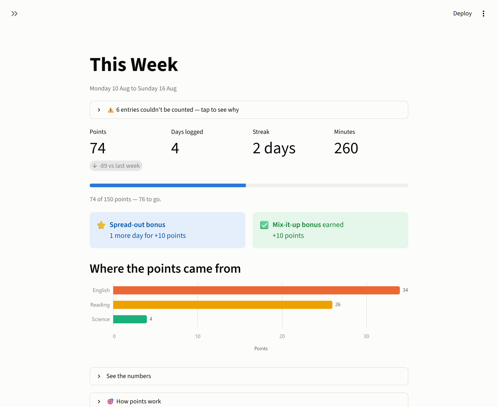
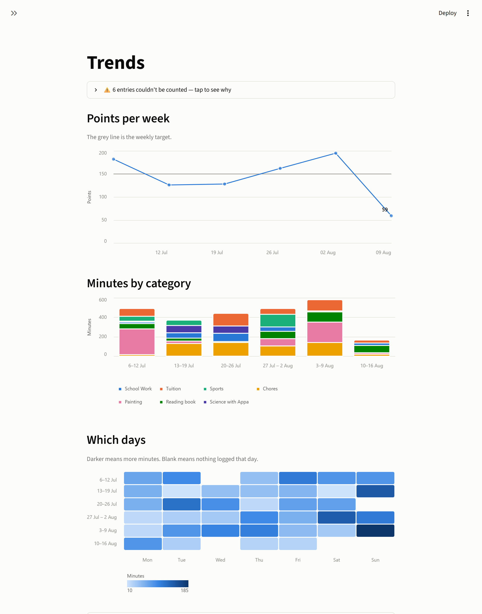
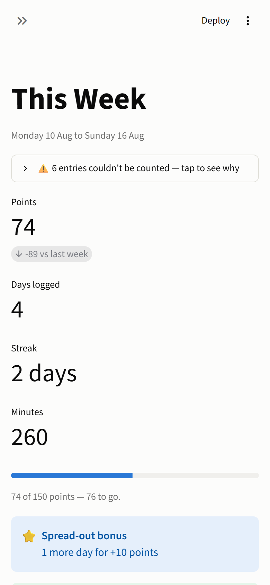

# Effort Tracker

A small Streamlit app for logging schoolwork and activities each week and turning
them into points that can be spent on rewards.

It rewards **doing the thing and keeping it up, not marks**. What an entry is
worth per minute depends on the *kind* of thing it was — the rates are agreed
once and written down, so there's no self-rating to argue about and nothing to
judge in the moment. Points are never negative and are never taken away.



## Running it

Needs [uv](https://docs.astral.sh/uv/). Python 3.12 is pinned in `.python-version`
and uv will fetch it.

```bash
uv sync
uv run streamlit run app.py
```

Tests:

```bash
uv run pytest
```

## The log

The app reads `data/Efforts_Logged.csv` if it exists, and falls back to the
sample that ships with the repo (`data/sample_effort_log.csv`). Columns:

| Column | Meaning |
| --- | --- |
| `date` | `2026-08-15` or `15/08/2026` — day-first, not month-first |
| `activity` | What she actually did, e.g. "Swimming", "Geography" |
| `category` | The *kind* of thing it was. This is what earns the multiplier. One of School Work, Tuition, Sports, Chores, Painting, Reading book, Science with Appa |
| `minutes` | A whole number above 0 |
| `effort` | Optional and no longer scored. May be blank, or left out entirely |
| `notes` | Optional, may be empty |

Rows that don't fit are never fatal. They're set aside, counted separately, and
listed with a plain-English reason in a panel at the top of every page; the rest
of the log is scored as normal.

To check a file without opening the app:

```bash
uv run python scripts/check_data.py path/to/log.csv
```

## How points work

<!-- points-rules:start -->
<!-- Generated from POINTS_CONFIG. Run: uv run python scripts/update_readme.py -->

**Every 5 minutes you spend is worth 1 point.**

Then the *kind* of thing it was decides what those minutes are worth. You don't
have to rate yourself — the rate is the same every time, and you can see it here.

| What you did | Worth | For example |
| --- | --- | --- |
| Painting | ×2 | 30 minutes → **12 points** |
| Piano | ×2 | 30 minutes → **12 points** |
| Reading book | ×2 | 30 minutes → **12 points** |
| Science with Appa | ×2 | 30 minutes → **12 points** |
| Sports | ×1.5 | 30 minutes → **9 points** |
| Chores | ×1.25 | 30 minutes → **8 points** |
| Tuition | ×1.25 | 30 minutes → **8 points** |
| School Work | ×1 | 30 minutes → **6 points** |

**Two bonuses, each worth 10 points, for whole weeks:**

- **Spread-out bonus** — log something on 5 or more different days in a week.
- **Mix-it-up bonus** — log 3 or more different categories in a week.

**The small print:**

- One activity counts for up to **60 minutes a day**. Do more if you want to —
  it still shows up in your charts, it just stops earning points. If you do the
  same thing twice in a day, the two sessions share those 60 minutes.
- Weeks run **Monday to Sunday**. Bonuses are worked out when the week ends.
- Half a point always rounds **up**, never down.
- **Points are never taken away.** Once you've earned them, they're yours — you
  can't go backwards, and nothing you do can make your total go down.

<!-- points-rules:end -->

All of the numbers above live in one place — `POINTS_CONFIG` at the top of
[`src/effort/points.py`](src/effort/points.py). Changing one changes the engine,
the "How points work" panel in the app, and (after running
`scripts/update_readme.py`) this section, so the three can't drift apart.

## Pages

- **This Week** — points, progress against an adjustable target, days logged,
  streak, both bonuses, where the points came from, and how it compares to last
  week.
- **Trends** — points per week, minutes by category per week, and a day-of-week
  heatmap. The sidebar category filter scopes all three.
- **Rewards** — an editable catalogue, the balance, and redeeming. Rewards you
  can't afford are greyed out rather than erroring.



## Layout

```
app.py                    navigation only
src/effort/
  config.py               the data contract and file locations
  loading.py              reads the CSV, interprets nothing
  validation.py           typed rows out, explained problems out
  points.py               POINTS_CONFIG + the engine
  rewards.py              catalogue and append-only ledger
  theme.py                chart palette, light and dark
  ui/                     one module per page
tests/test_points.py      the engine's rules
scripts/                  data check, sample generator, readme updater
```

## Privacy

This repo is public, so `.gitignore` blocks **every** CSV except the sample, plus
`data/rewards.json` and `data/ledger.csv`. Her real log, her reward list and her
redemption history stay on the machine. Verify with:

```bash
git check-ignore -v data/effort_log.csv data/ledger.csv data/rewards.json
```

## Phone

The app is laid out `centered` rather than `wide` and was checked at 390px — no
sideways scrolling, charts reflow, columns stack.


